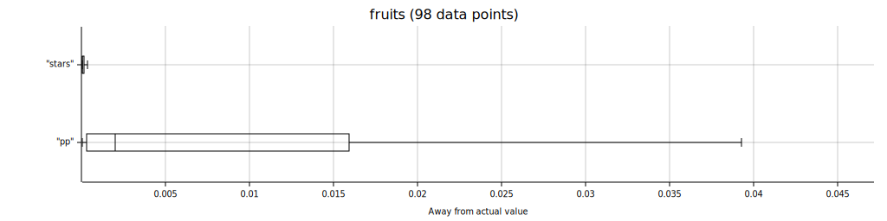

[](https://crates.io/crates/rosu-pp) [](https://docs.rs/rosu-pp)

# rosu-pp

A standalone crate to calculate star ratings and performance points for all [osu!](https://osu.ppy.sh/home) gamemodes.

Conversions between game modes (i.e. "converts") are generally not supported.

Async is supported through features, see below.

### Usage

```rust
use rosu_pp::{Beatmap, BeatmapExt};

// Parse the map yourself
let map = match Beatmap::from_path("/path/to/file.osu") {
    Ok(map) => map,
    Err(why) => panic!("Error while parsing map: {}", why),
};

// If `BeatmapExt` is included, you can make use of
// some methods on `Beatmap` to make your life simpler.
let result = map.pp()
    .mods(24) // HDHR
    .combo(1234)
    .misses(2)
    .accuracy(99.2) // should be called last
    .calculate();

println!("PP: {}", result.pp());

// If you intend to reuse the current map-mod combination,
// make use of the previous result!
// If attributes are given, then stars & co don't have to be recalculated.
let next_result = map.pp()
    .mods(24) // HDHR
    .attributes(result) // recycle
    .combo(543)
    .misses(5)
    .n50(3)
    .accuracy(96.5)
    .calculate();

println!("Next PP: {}", next_result.pp());

let stars = map.stars()
    .mods(16)  // HR
    .calculate()
    .stars();

let max_pp = map.max_pp(16).pp();

println!("Stars: {} | Max PP: {}", stars, max_pp);
```

### With async
If either the `async_tokio` or `async_std` feature is enabled, beatmap parsing will be async.

```rust
use rosu_pp::{Beatmap, BeatmapExt};

// Parse the map asynchronously
let map = match Beatmap::from_path("/path/to/file.osu").await {
    Ok(map) => map,
    Err(why) => panic!("Error while parsing map: {}", why),
};

// The rest stays the same
let result = map.pp()
    .mods(24) // HDHR
    .combo(1234)
    .misses(2)
    .accuracy(99.2)
    .calculate();

println!("PP: {}", result.pp());
```

### Gradual calculation
Sometimes you might want to calculate the difficulty of a map or performance of a score after each hit object.
This could be done by using `passed_objects` as the amount of objects that were passed so far.
However, this requires to recalculate the beginning again and again, we can be more efficient than that.

Instead, you should use `GradualDifficultyAttributes` and `GradualPerformanceAttributes`:

```rust
use rosu_pp::{
    Beatmap, BeatmapExt, GradualPerformanceAttributes, ScoreState, taiko::TaikoScoreState,
};

let map = match Beatmap::from_path("/path/to/file.osu") {
    Ok(map) => map,
    Err(why) => panic!("Error while parsing map: {}", why),
};

let mods = 8 + 64; // HDDT

// If you're only interested in the star rating or other difficulty value,
// use `GradualDifficultyAttribtes`, either through its function `new`
// or through the method `BeatmapExt::gradual_difficulty`.
let gradual_difficulty = map.gradual_difficulty(mods);

// Since `GradualDifficultyAttributes` implements `Iterator`, you can use
// any iterate function on it, use it in loops, collect them into a `Vec`, ...
for (i, difficulty) in gradual_difficulty.enumerate() {
    println!("Stars after object {}: {}", i, difficulty.stars());
}

// Gradually calculating performance values does the same as calculating
// difficulty attributes but it goes the extra step and also evaluates
// the state of a score for these difficulty attributes.
let mut gradual_performance = map.gradual_performance(mods);

// The default score state is kinda chunky because it considers all modes.
let state = ScoreState {
    max_combo: 1,
    n_katu: 0, // only relevant for ctb
    n300: 1,
    n100: 0,
    n50: 0,
    misses: 0,
    score: 300, // only relevant for mania
};

// Process the score state after the first object
let curr_performance = match gradual_performance.process_next_object(state) {
    Some(perf) => perf,
    None => panic!("the map has no hit objects"),
};

println!("PP after the first object: {}", curr_performance.pp());

// If you're only interested in maps of a specific mode, consider
// using the mode's gradual calculator instead of the general one.
// Let's assume it's a taiko map.
// Instead of starting off with `BeatmapExt::gradual_performance` one could have
// created the struct via `TaikoGradualPerformanceAttributes::new`.
let mut gradual_performance = match gradual_performance {
    GradualPerformanceAttributes::Taiko(gradual) => gradual,
    _ => panic!("the map was not taiko but {:?}", map.mode),
};

// A little simpler than the general score state.
let state = TaikoScoreState {
    max_combo: 11,
    n300: 9,
    n100: 1,
    misses: 1,
};

// Process the next 10 objects in one go
let curr_performance = match gradual_performance.process_next_n_objects(state, 10) {
    Some(perf) => perf,
    None => panic!("the last `process_next_object` already processed the last object"),
};

println!("PP after the first 11 objects: {}", curr_performance.pp());
```

### Features

| Flag | Description |
|-----|-----|
| `default` | Beatmap parsing will be non-async |
| `async_tokio` | Beatmap parsing will be async through [tokio](https://github.com/tokio-rs/tokio) |
| `async_std` | Beatmap parsing will be async through [async-std](https://github.com/async-rs/async-std) |

### Accuracy

Here are some plots showing the differences of `rosu-pp`'s values and osu!'s official [osu-tools](https://github.com/ppy/osu-tools).

Note that osu-tools was used on [this commit](https://github.com/ppy/osu/commit/9fb2402781ad91c197d51aeec716b0000f52c4d1) which is currently (2021-11-14) accurate for osu!standard but for other modes it might include changes that were not applied into stable and thus not implemented in rosu-pp.

osu!standard: (very accurate, flashlight has the highest average but is still very small)


osu!mania: (close to perfect values)


osu!catch: (pretty accurate)


osu!taiko: (decently accurate, potentially more imprecise due to non-live changes in osu-tools)

