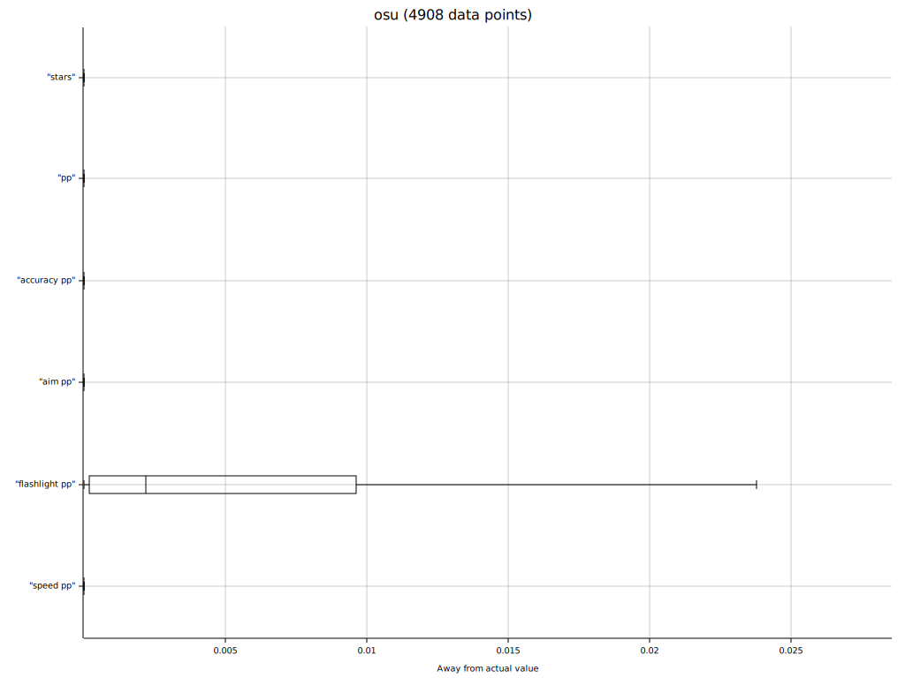
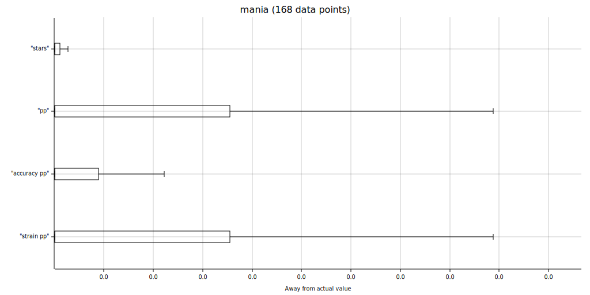
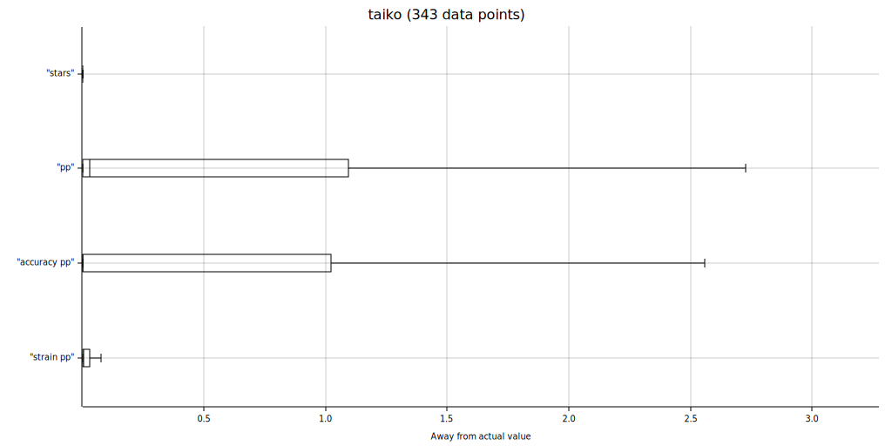

[](https://crates.io/crates/rosu-pp) [](https://docs.rs/rosu-pp)

# rosu-pp

A standalone crate to calculate star ratings and performance points for all [osu!](https://osu.ppy.sh/home) gamemodes.

Conversions between gamemodes are generally not supported.

Async is supported through features, see below.

### Usage

```rust
use std::fs::File;
use rosu_pp::{Beatmap, BeatmapExt};

let file = match File::open("/path/to/file.osu") {
    Ok(file) => file,
    Err(why) => panic!("Could not open file: {}", why),
};

// Parse the map yourself
let map = match Beatmap::parse(file) {
    Ok(map) => map,
    Err(why) => panic!("Error while parsing map: {}", why),
};

// If `BeatmapExt` is included, you can make use of
// some methods on `Beatmap` to make your life simpler.
let result = map.pp()
    .mods(24) // HDHR
    .combo(1234)
    .misses(2)
    .accuracy(99.2)
    .calculate();

println!("PP: {}", result.pp());

// If you intend to reuse the current map-mod combination,
// make use of the previous result!
// If attributes are given, then stars & co don't have to be recalculated.
let next_result = map.pp()
    .mods(24) // HDHR
    .attributes(result) // recycle
    .combo(543)
    .misses(5)
    .n50(3)
    .passed_objects(600)
    .accuracy(96.5)
    .calculate();

println!("Next PP: {}", next_result.pp());

let stars = map.stars(16, None).stars(); // HR
let max_pp = map.max_pp(16).pp();

println!("Stars: {} | Max PP: {}", stars, max_pp);
```

### With async
If either the `async_tokio` or `async_std` feature is enabled, beatmap parsing will be async.

```rust
use async_std::fs::File;
// use tokio::fs::File;

let file = match File::open("/path/to/file.osu").await {
    Ok(file) => file,
    Err(why) => panic!("Could not open file: {}", why),
};

// Parse the map asynchronously
let map = match Beatmap::parse(file).await {
    Ok(map) => map,
    Err(why) => panic!("Error while parsing map: {}", why),
};

// The rest stays the same
let result = map.pp()
    .mods(24) // HDHR
    .combo(1234)
    .misses(2)
    .accuracy(99.2)
    .calculate();

println!("PP: {}", result.pp());
```

### Features

| Flag | Description |
|-----|-----|
| `default` | Enable all modes. |
| `osu` | Enable osu!standard. |
| `taiko` | Enable osu!taiko. |
| `fruits` | Enable osu!ctb. |
| `mania` | Enable osu!mania. |
| `async_tokio` | Beatmap parsing will be async through [tokio](https://github.com/tokio-rs/tokio) |
| `async_std` | Beatmap parsing will be async through [async-std](https://github.com/async-rs/async-std) |

### Accuracy

Here are some plots showing the differences of `rosu-pp`'s values and osu!'s official [osu-tools](https://github.com/ppy/osu-tools).

Note that osu-tools was used on [this commit](https://github.com/ppy/osu/commit/9fb2402781ad91c197d51aeec716b0000f52c4d1) which is currently (2021-11-14) accurate for osu!standard but for other modes it might include changes that were not applied into stable and thus not implemented in rosu-pp.

osu!standard: (very accurate, flashlight has the highest average but is still very small)


osu!mania: (close to perfect values)


osu!catch: (pretty accurate)


osu!taiko: (decently accurate, potentially more imprecise due to non-live changes in osu-tools)

